#  AI 智能体平台

## 一、什么是 AI 智能体平台？

在讲 AI 智能体平台之前，我先帮大家理清几个容易混淆的概念：

1）零代码平台（Bolt.new、Lovable、秒哒）：一句话生成完整项目，适合快速做网站和应用。

你说一句话，AI 生成代码，你预览效果，满意就部署。整个过程可能只需要几分钟。

2）AI 应用开发平台（Dify、Coze、百炼）：可视化配置 AI 应用，适合做智能客服、知识库问答等 AI 应用。

你通过拖拽的方式配置工作流，设置提示词和知识库，不需要写代码。

3）AI 智能体平台（Flowith、Manus）：AI 自主规划和执行复杂任务，可以持续运行几个小时甚至几天。

你只需要描述目标，AI 会自己规划步骤、调用工具、执行任务，直到完成为止。

简单来说，**AI 智能体平台就是让 AI 当项目经理，你只需要告诉它目标，它会自己规划和执行。**

## 二、Flowith：无限执行的 AI 智能体

[Flowith](https://flowith.io) 是目前最火的 AI 智能体平台之一，被称为"世界上第一款无限的 AI 智能体"（也可能是自称）。

什么叫"无限"？

如果我们把 AI 智能体想象成人类，有的人拿到任务后，觉得太复杂或者遇到困难就放弃了；而有的人哪怕废寝忘食、拼了一辈子，也要坚持完成任务。

Flowith 便是后者，**无限的步骤、无限的上下文、无限的工具**，使得它能够持续不断地自主执行任务，直到完成才罢休。

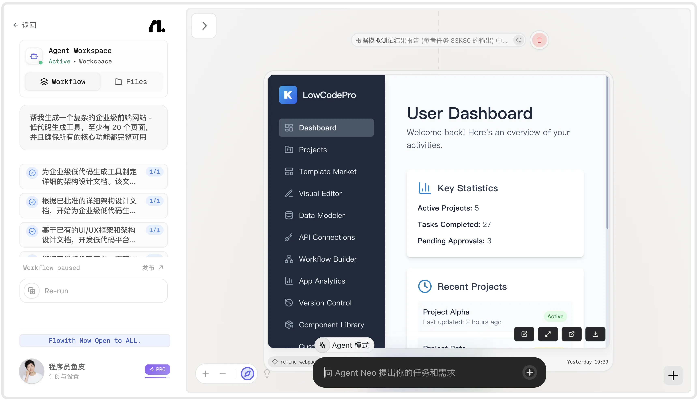

### 2.1 怎么使用 Flowith？

让我用几个实际例子来演示 Flowith 的强大能力。

#### 2.1.1 生成复杂大型网站

进入 [Flowith 主页](https://flowith.io)，看到了熟悉的 AI 对话页面。这是 Flowith 的基础功能，可以生成文本、图片、视频，利用联网搜索工具和自定义知识库来丰富回答的内容。

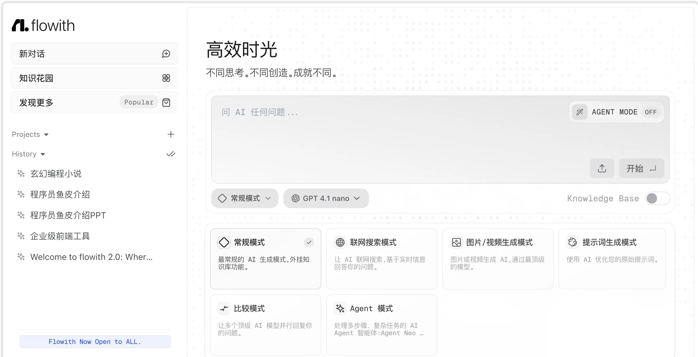

我比较喜欢的是 **比较模式** 这个功能，可以选择各种主流大模型，快速对比同一个提示词的作答效果：

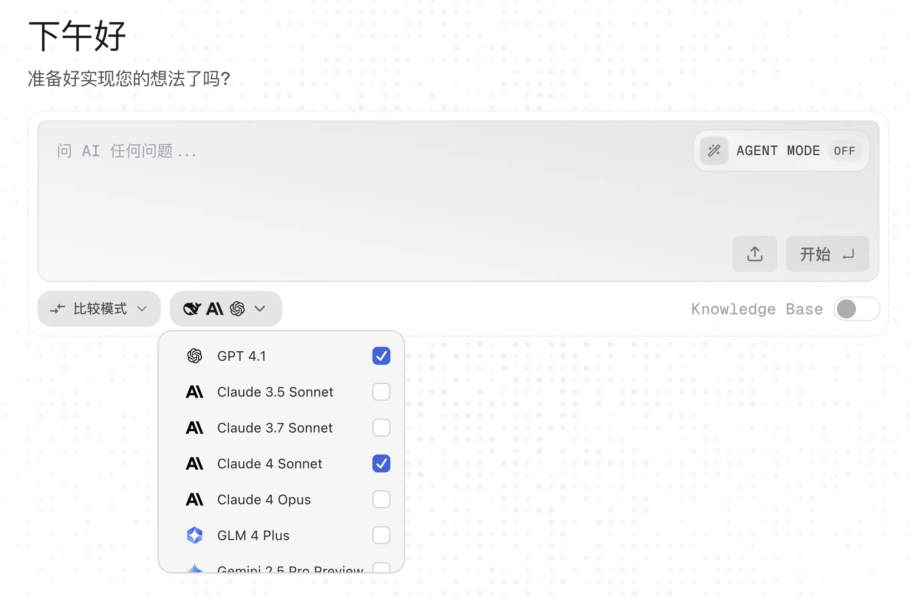

下面让我们开启 Flowith 的 **Agent 模式**，也就是能够在云端自主规划任务、调用工具分步骤完成任务的超级智能体。并且开启 **无限模式**，让它一直工作直到完成任务。

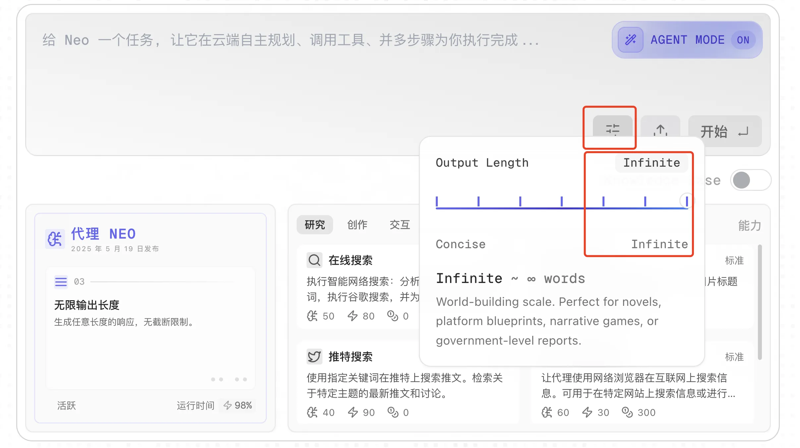

输入提示词：

```markdown
帮我生成一个复杂的企业级前端网站 - 低代码生成工具。
至少有 20 个页面，并且确保所有的核心功能都完整可用。
```

执行后，我们会进入到 **工作流画布页面**，可以看到，AI 首先为整个任务规划出了非常多的步骤。比如要制作网站，需要先写详细的架构设计文档、然后构建基础 UI 框架、再依次开发各个页面。


这就是 AI 智能体能够自主执行复杂任务的原理。虽然没办法一次性完成大任务，那就先把任务分解成若干小任务，然后逐个完成并总结最终的结果。

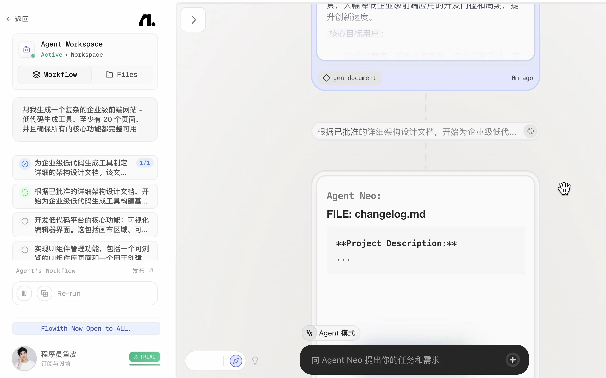

AI 会自主选择合适的工具来完成任务，比如生成网站并部署到云端服务器上，让我们可以实时查看每一步生成的网站效果：

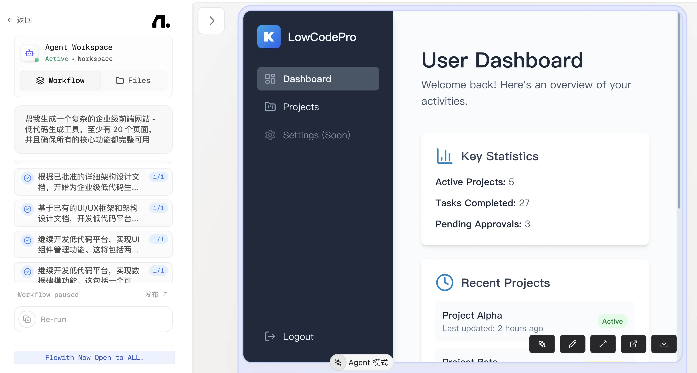

经过了漫长的等待，大概 2 个小时左右，整个网站终于生成完成。我之前在 Cursor 中使用智能体，从来没有自主执行过这么长的时间。

让我们看看生成的文件。首先生成的文档非常齐全，什么测试报告、发布确认文档、系统维护指南、测试计划、总结报告，应有尽有。

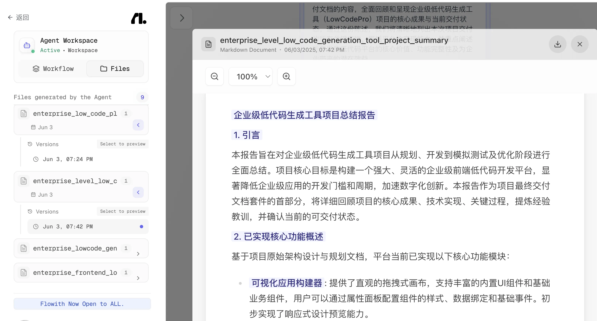

再看看生成的项目代码，页面文件还算完整，生成了 5000 多行代码，属于中小型项目的规模。

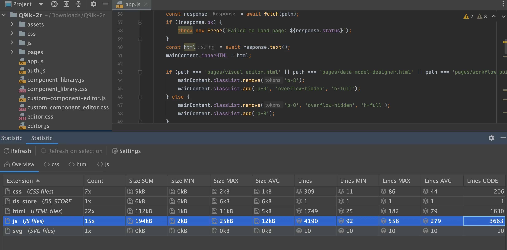

运行下网站看看效果。估计是用的国外大模型，生成的网站纯英文，页面有模有样，符合低代码平台的功能和设计。

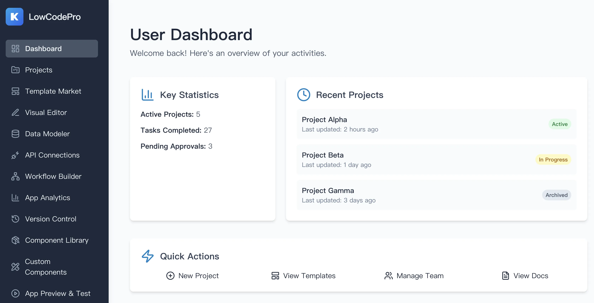

但是由于缺少后端以及示例数据，很多页面的功能是没有办法验证的，效果看起来也一般。

#### 2.1.2 生成几十页 PPT

下面我们再来搞一个更复杂的任务，生成一个至少有 50 页的 PPT：

```markdown
帮我生成一个 PPT，用于从全方面介绍程序员鱼皮，至少 50 页。
```

这次的 AI 智能体显然更聪明，先同时调用了多个网页搜索工具，从不同的来源搜索到信息，然后再进行整合：

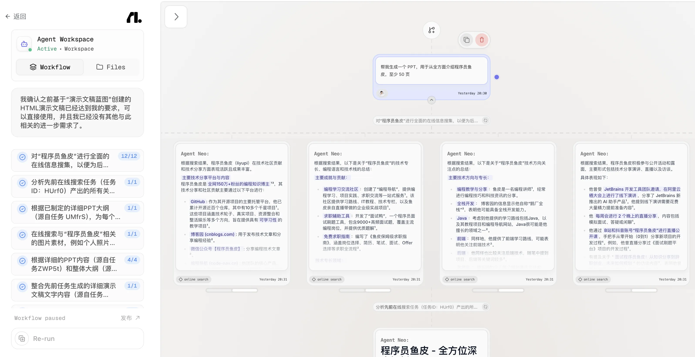

AI 在给 PPT 准备图片素材时也很聪明，不仅从网络上搜索到了图片，而且还调用其他的 AI 绘图大模型并行生成了多张配图。实话说，这个小卡片的效果确实惊艳到我了。


有趣的是，我发现 AI 并不是"死脑筋"。在执行任务的过程中，它可能会根据情况重新规划步骤；有时还会主动询问用户的意见，能够让我们参与进来，指导 AI 更好地完成任务。

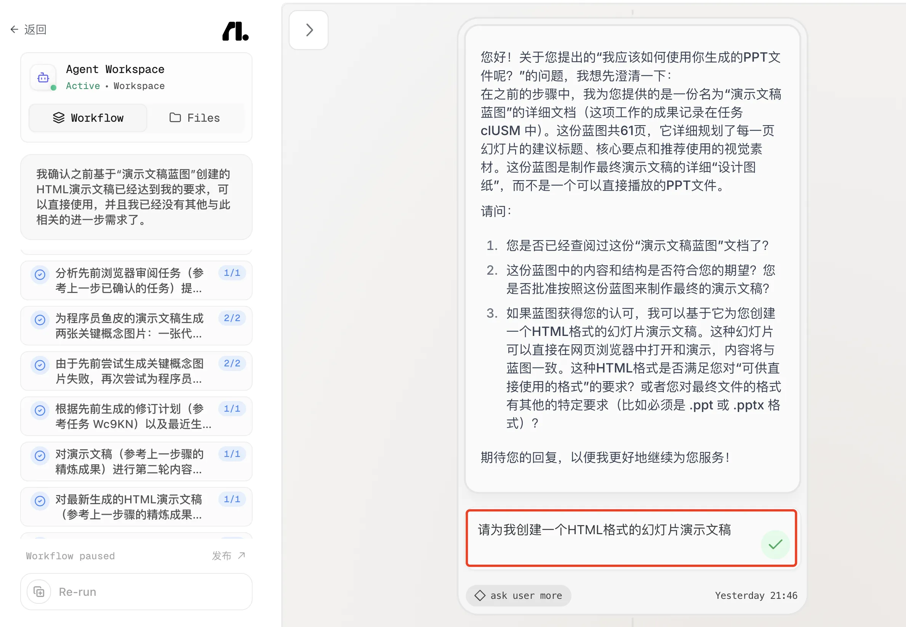

不过任务的执行并非一帆风顺，有的时候会出现步骤执行失败的情况，不过 AI 会自动重试：

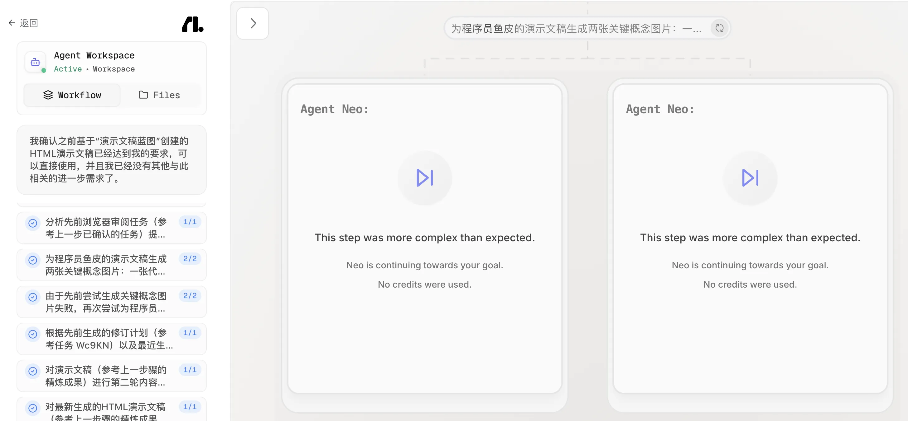

但更严重的是任务卡死。比如我一直卡在使用浏览器运行工具这一步，这时就需要手动重新执行。不过仔细想想也挺合理，人类工作有时候也会摸鱼睡着了，这时就需要其他人把他叫醒。

经过一个多小时，AI 终于生成了一个可在线访问的 PPT 网页，甚至部署到了服务器上。我们可以直接查看浏览效果：

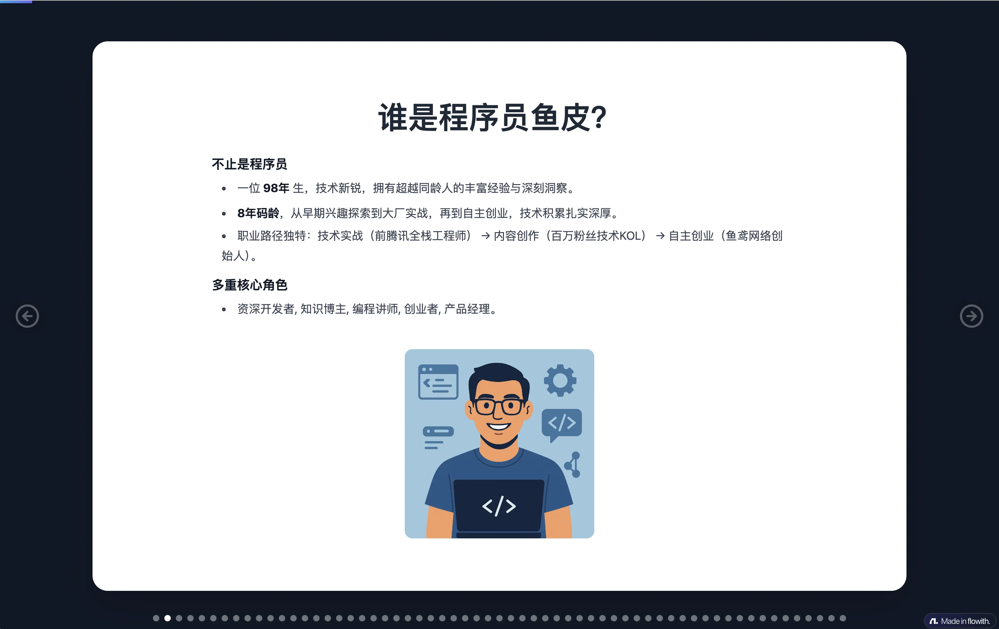

有一说一，我感觉还挺不错的。虽然生成的不是标准的 PPT 格式，而是 HTML 网页代码，但是利用工具，也能直接转成 PPT 格式。


#### 2.1.3 生成自媒体图文

下面再让 AI 生成一篇自媒体图文：

```markdown
我是一位自媒体知识博主，请帮我生成一篇图文并茂的图文稿子。
主题是【介绍程序员鱼皮的编程导航学习网站】
```

建议大家每隔一段时间来看看 AI 的工作进度，说不定有时 AI 会主动询问你的建议，你不回答就会一直卡在这里（当然也可以跳过）。

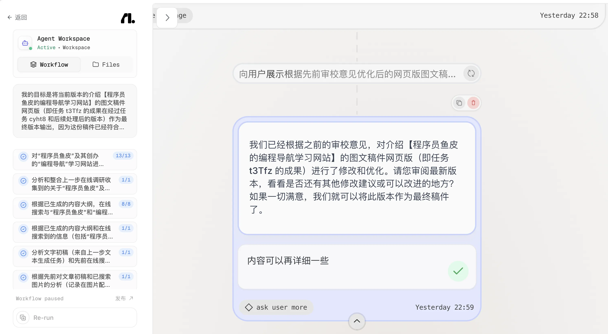

大概过了 30 分钟，AI 完成了任务，生成了一个图文并茂的网站，效果还不错。


不得不说，AI 真的很喜欢生成网站啊。这也提醒我们，如果想让 AI 更准确地完成复杂任务，就一定要把任务描述清楚（比如生成 Markdown 格式的图文）。

### 2.2 Flowith 的优缺点

Flowith 的优势很明显。首先是 **无限执行能力**，可以持续运行几个小时甚至几天，完成超级复杂的任务。而且 AI 的规划和自我修正能力很强，能够根据情况调整计划。

还有就是 **并行执行能力**，可以同时调用多个 AI 模型或工具，大大提高效率。而且支持云端部署，生成的网站可以直接在线访问。

当然也有一些局限。首先是 **执行效率比较低**，同样的任务，Cursor 可能 10 分钟就能完成，Flowith 可能需要 1-2 个小时。而且消耗的费用不太可控，长时间运行会消耗大量的 Token。

另外，定制修改能力一般。如果你想精确控制每一步，Flowith 可能不太适合。它更适合那种"我不管过程，只要结果"的场景。

价格上，Flowith 有免费版和付费版。免费版有使用限制，付费版根据使用量计费。

## 三、Manus：通用 AI 智能体

[Manus](https://manus.im) 是另一个非常火的 AI 智能体平台，刚出的时候直接爆火。

Manus 采用多模型协同机制，具备强大的工具调用能力，能在多个领域自动生成和执行任务。而且 Manus 的自主规划能力很强，能够独立思考和规划，确保任务的执行。

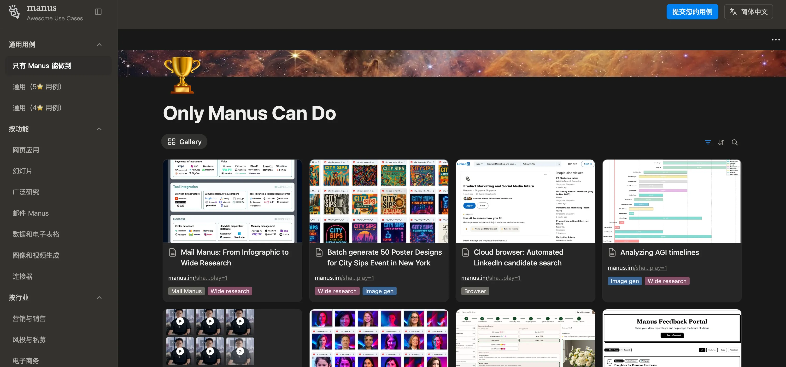

比如在房产选购任务中，Manus 能分解为社区安全分析、预算计算、房源筛选等子任务，并通过代码智能体重构思考过程，确保透明可追溯。

## 四、OpenManus：开源版 Manus

[OpenManus](https://github.com/mannaandpoem/OpenManus) 是 Manus 的开源版本，据说是由几个 00 后用 3 小时复刻出来的。

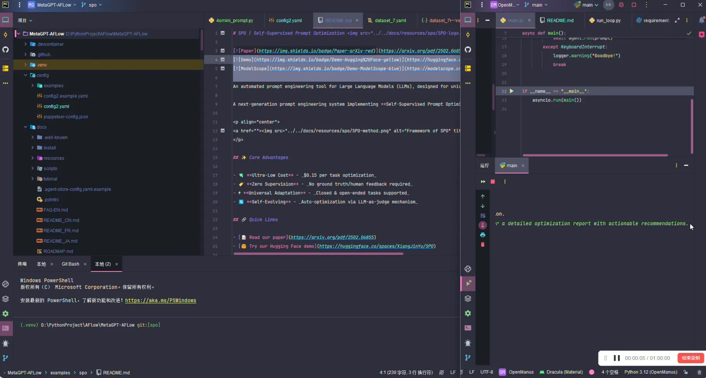

虽然功能没有 Manus 那么完善，但基本的智能体能力都有。而且完全开源免费，可以自己部署和定制。

OpenManus 是一个模块化的开源智能体框架，适用于：

- 研究原型验证
- 智能体编排实验
- 自动化工作流
- 将多模态/LLM 能力集成到现有系统

如果你喜欢折腾，想深入了解 AI 智能体的实现原理，OpenManus 是个不错的选择。

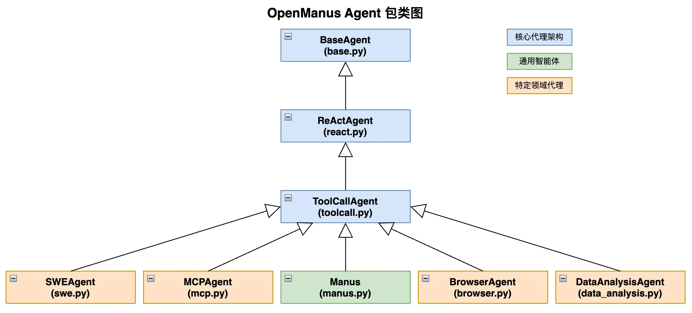

## 五、AI 智能体平台实战建议

如果你想尝试 AI 智能体平台，我有几个建议：

### 5.1 任务描述要清晰

虽然 AI 能自主规划，但你的任务描述越清晰，AI 的执行效果就越好。不要只说"做一个网站"，而是要说清楚：

- 网站的类型（企业官网、博客、电商等）
- 核心功能（至少列出 3-5 个）
- 风格要求（简洁、现代、卡通等）
- 技术要求（如果有的话）

### 5.2 要有耐心

AI 智能体平台的执行时间比较长，可能需要几个小时。建议：

- 选择一个不太忙的时间开始任务
- 定期查看进度，及时回复 AI 的询问
- 如果任务卡住了，手动重新执行

### 5.3 控制成本

长时间运行会消耗大量的 Token，成本可能会比较高。建议：

- 先用免费额度测试
- 明确任务范围，避免 AI 做太多不必要的事情
- 如果预算有限，可以选择用 Cursor 或者其他 AI 编程工具分步骤完成

### 5.4 结合其他工具使用（按需）

AI 智能体平台更适合生成基础内容，然后再用 Cursor 进行精修。比如：

- 用 Flowith 生成大型网站的基础框架
- 导出代码到 Cursor 中
- 用 Cursor 进行细节优化和功能完善

这样既能利用 Flowith 的自主执行能力，又能利用 Cursor 的精确控制能力。

## 最后

看到这里，相信你已经对 AI 智能体平台有了全面的了解。

我建议不要把它当成日常开发工具，而是当成一个特殊场景的补充工具。如果你需要生成大量内容又不想人工投入精力、或者想快速搭建一个大型项目的框架时，可以试试 Flowith 等 AI 智能体平台。

到这里，我们已经学习了零代码开发的各种工具。从快速生成项目的零代码平台，到能自主执行复杂任务的 AI 智能体平台，这些工具都不需要你写代码，就能做出功能强大的应用。

但如果你想更深入地学习编程，想要更精确地控制代码，那么 AI 代码编辑器会更适合你。
