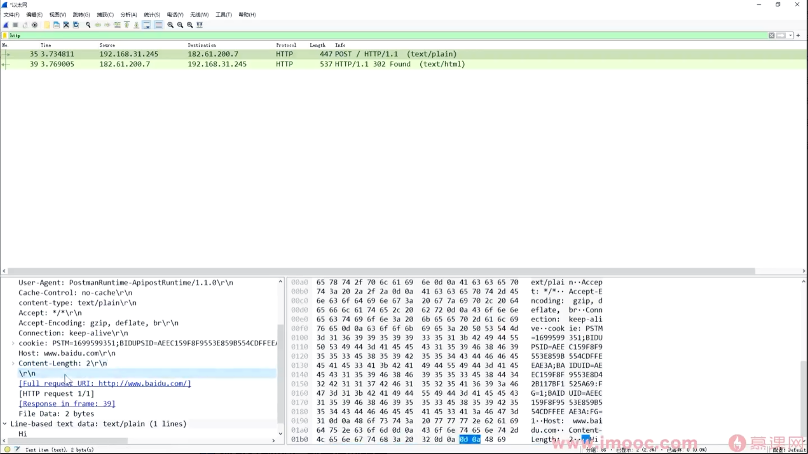

# 抓包分析与数据封装过程

## 一、抓包基本概念

* **抓包（Packet Capture）**：捕获经过本机网卡的数据包（包括发送和接收）
* 本质：分析网络通信过程中真实传输的数据

常见工具：

* Wireshark（抓包工具）
* Postman / Apipost（发送请求工具）
* 浏览器（也可发送请求）

## 二、实验流程



1. 使用工具发送一个 HTTP 请求（POST）
2. 启动 Wireshark 抓包（选择网卡，如以太网）
3. 发送请求数据（如 `"hi"`）
4. 停止抓包
5. 使用过滤条件（如 `http`）筛选目标数据包

## 三、为什么会抓到很多包？

原因：

* Wireshark 抓的是：

  > **网卡在该时间段内的所有流量**

包括：

* HTTP（应用层）
* TCP（传输层）
* DNS（域名解析）
* 其他系统通信数据

👉 解决办法：

* 使用过滤器（如 `http`）筛选目标包

## 四、数据的本质：一开始就是二进制

例如发送 `"hi"`：

* 字符 → 编码（ASCII）
* `"h"` → `0x68`
* `"i"` → `0x69`

👉 最终：

```text
68 69（十六进制） → 二进制（0101）
```

关键点：

* **计算机始终处理的是二进制**
* 十六进制只是便于人类阅读

## 五、数据封装过程（抓包验证）

发送 `"hi"` 的完整过程：

### 1️⃣ 应用层（HTTP）

* 添加 HTTP 协议头
* 包含：

  * 请求行
  * 请求头
  * Content-Length 等信息

👉 数据结构：

```
HTTP头 + 数据（hi）
```

### 2️⃣ 传输层（TCP）

* 添加 TCP 头
* 包含：

  * 源端口
  * 目标端口

### 3️⃣ 网络层（IP）

* 添加 IP 头
* 包含：

  * 源 IP
  * 目标 IP

### 4️⃣ 数据链路层（Ethernet）

* 添加：

  * 帧头（MAC 地址）
  * 帧尾（校验）

⚠️ 注意：

* **抓包中看不到帧尾（FCS）**
* 原因：

  * 网卡已完成校验并移除

---

### 5️⃣ 物理层

* 将二进制转换为信号：

  * 电信号
  * 光信号
  * 无线电波

## 六、接收端解封过程（对应抓包理解）

### 1️⃣ 数据链路层

* 解析帧结构：

  * 前 6 字节：目标 MAC
  * 后 6 字节：源 MAC

* 判断：

  * 是否发给自己
  * 否 → 丢弃

### 2️⃣ 网络层（IP）

* 提取：

  * 源 IP
  * 目标 IP

* 判断：

  * 是否发给自己
  * 否 -> 丢弃 or 转发

### 3️⃣ 传输层（TCP）

* 提取：

  * 源端口
  * 目标端口

👉 作用：

* 确定交给哪个进程

### 4️⃣ 应用层（HTTP）

解析规则：

#### 读取方式：

* 按行读取（`\r\n` → `0D0A`）
* 每一行表示一个字段

#### 关键规则：

* **两个连续的 `\r\n` 表示头部结束**

```text
Header\r\n
Header\r\n
\r\n  ← 分隔
Body
```

#### 数据长度判断：

* 根据 `Content-Length`

例如：

```
Content-Length: 2
```

👉 表示读取 2 个字节 → `"hi"`

## 七、关键理解点（重点）

### 1️⃣ 数据始终是二进制

* 从应用层开始就是 0101
* 所有协议处理的都是二进制

### 2️⃣ 抓包看到的是“封装后的结果”

* 实际展示是：

  * 各层协议头 + 数据

### 3️⃣ 协议的本质

> 协议 = 通信双方的约定

作用：

* 定义数据格式
* 定义解析规则

### 4️⃣ 为什么接收端能解析数据？

因为：

* 收发双方遵循**相同协议**
* 知道：

  * 哪些字节表示什么
  * 从哪里开始读

### 5️⃣ 分层解析过程

```text
链路层 → 网络层 → 传输层 → 应用层
```

逐层：

* 读取头部
* 提取信息
* 去掉头部
* 上交数据

## 八、核心总结

### 1️⃣ 抓包的意义

> 让你看到网络通信的真实数据结构

### 2️⃣ 数据传输本质

```text
发送端：封装（加协议头）
接收端：解封（按协议解析）
```

### 3️⃣ 最重要一句话

> **发送方按协议发，接收方按相同协议收，否则无法通信**