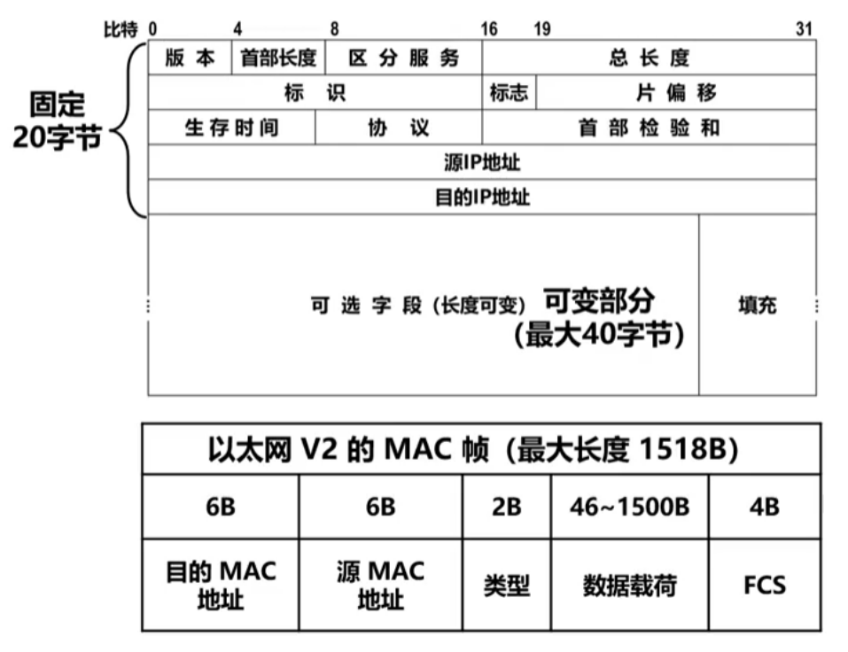

# 🌐 网络层核心协议 —— IP 协议

## 一、IP 协议概述

- **IP（Internet Protocol）= 网际协议**
- 在 TCP/IP 四层模型中属于：
  - **网际层（网络层）核心协议**
- 作用：
  - 实现**跨网络的数据传输**
  - 提供**无连接、不可靠的分组传输服务**

📌 面试关键词：

- 无连接（Connectionless）
- 尽力而为（Best Effort）
- 不保证可靠性（可能丢包、乱序）

------

## 二、IP 数据报结构（重点）

### 1️⃣ 基本结构

- 每行：**32 bit = 4 字节**
- 首部：
  - **最小：20 字节**
  - **最大：60 字节**
- 组成：

```
固定部分（20B） + 可选字段（0~40B）
```

------

## 三、首部字段详解（高频面试点）



### 1️⃣ 版本（Version）

- 表示 IP 协议版本
- 常见：
  - IPv4 → 4
  - IPv6 → 6

------

### 2️⃣ 首部长度（IHL）

- 单位：**4 字节**
- 实际长度：

```
首部长度 × 4
```

📌 范围：

- 最小：5 → 20B
- 最大：15 → 60B

------

### 3️⃣ 总长度（Total Length）

- 表示：

```
IP数据报总长度 = 首部 + 数据
```

📌 推导：

```
数据长度 = 总长度 - 首部长度
```

------

## 四、分片机制（🔥高频面试题）

### 背景

- 以太网 MTU = **1500 字节**
- IP 数据报可能 > 1500
  👉 必须 **分片（Fragmentation）**

------

### 1️⃣ 标识（Identification）

- 同一个数据报的所有分片：
  - **标识相同**

📌 作用：
👉 用于接收端**重组数据**

------

### 2️⃣ 标志（Flags）

共 3 位：

| 位          | 含义             |
| ----------- | ---------------- |
| 第1位       | 保留             |
| 第2位（DF） | 是否允许分片     |
| 第3位（MF） | 是否还有后续分片 |

#### 关键逻辑：

- DF = 1 → ❌ 不允许分片
- MF = 1 → 后面还有分片
- MF = 0 → 最后一片

------

### 3️⃣ 片偏移（Fragment Offset）

- 表示：

```
当前分片在原数据中的位置
```

📌 单位：

- **8字节**

#### 示例：

原数据：2000 字节 → 分2片

| 分片  | 数据范围  | 偏移 |
| ----- | --------- | ---- |
| 第1片 | 0~999     | 0    |
| 第2片 | 1000~1999 | 1000 |

👉 接收端根据：

- 标识 + 偏移 → 重组

------

## 五、TTL（生存时间）

### 定义

```
TTL = 数据包最多能经过的路由器数量
```

### 机制

- 每经过一个路由器：

```
TTL - 1
```

- 当 TTL = 0：
  👉 数据包被丢弃

------

### 作用（面试重点）

👉 防止 **路由环路**

#### 示例：

```
A → 路由器1 → 路由器2 → 路由器1（循环）
```

- 如果没有 TTL → ❌ 无限循环
- 有 TTL → ✅ 自动销毁

------

## 六、协议字段（Protocol）

### 作用

👉 指明上层协议类型

| 值   | 协议 |
| ---- | ---- |
| 6    | TCP  |
| 17   | UDP  |
| 1    | ICMP |

📌 面试点：

- ping 使用的是：
  - **ICMP**
  - 但 **封装在 IP 数据报中**

------

## 七、首部校验和（Header Checksum）

- 作用：
  👉 检测 **IP首部是否出错**

📌 注意：

- **只校验首部**
- 不校验数据

------

## 八、源地址 & 目的地址

- 各占 **32 位（IPv4）**

作用：

- 标识发送方和接收方

------

## 九、可选字段 + 填充（Options + Padding）

### 可选字段

- 可选功能（很少用）

### 填充（Padding）

👉 保证：

```
首部长度是 4 字节的整数倍
```

📌 原因：

- IHL × 4 计算长度

------

## 十、核心流程总结（面试高频）

### 发送流程：

```
应用层数据
→ IP封装（加IP头）
→ 数据链路层封装
→ 物理层发送
```

------

### 路由器处理流程：

```
收到数据帧
→ 去链路层头
→ 解析IP头
→ 查路由表
→ TTL-1
→ 重新封装
→ 转发
```

------

### 接收流程：

```
物理层 → 链路层 → 网络层
→ 去IP头
→ 上交传输层
```

------

## 十一、面试高频总结

### ⭐ 必问点

1. IP首部最小/最大长度？
   - 20B / 60B
2. 为什么要分片？
   - MTU 限制（1500B）
3. 如何重组分片？
   - 标识 + 片偏移
4. TTL作用？
   - 防止路由环路
5. Protocol字段作用？
   - 标识上层协议
6. 为什么首部长度要 ×4？
   - 单位是 4 字节

------

## 十二、一句话总结（面试加分）

👉 **IP协议的本质：**

> 提供一种“尽力而为”的跨网络数据传输机制，通过IP地址实现寻址，通过路由实现路径选择，通过TTL避免死循环，通过分片机制适配不同网络的MTU限制。