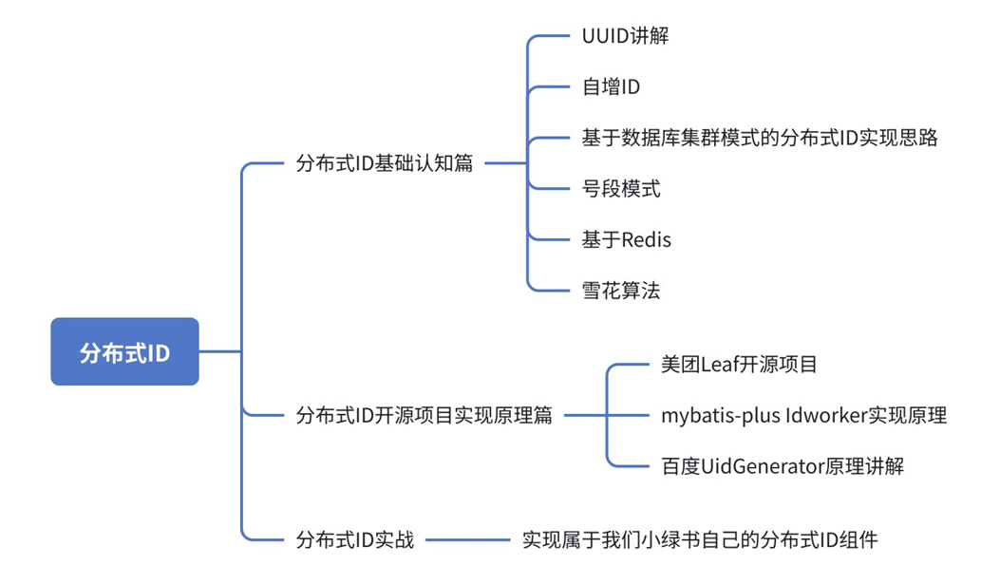
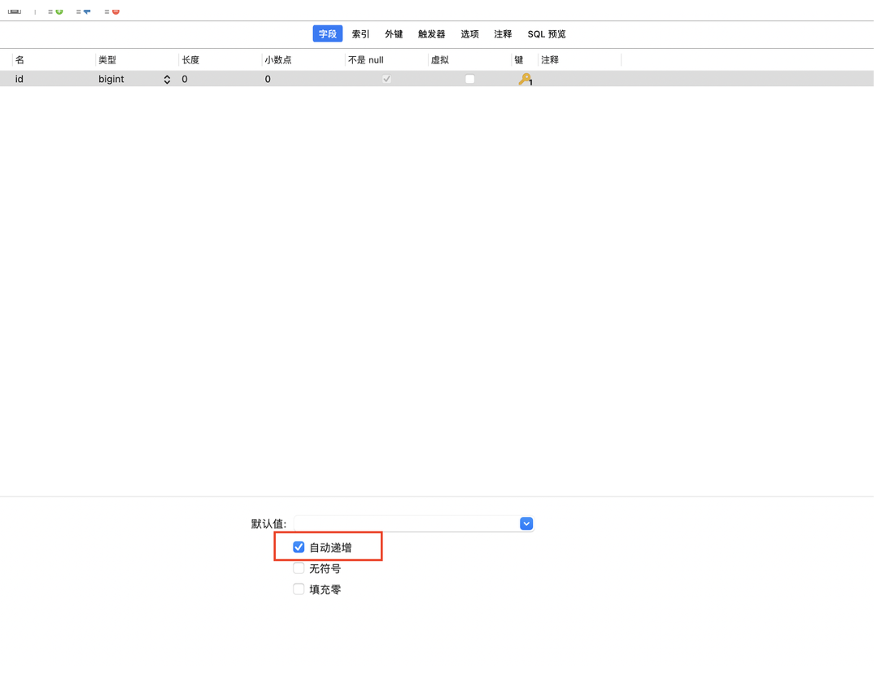
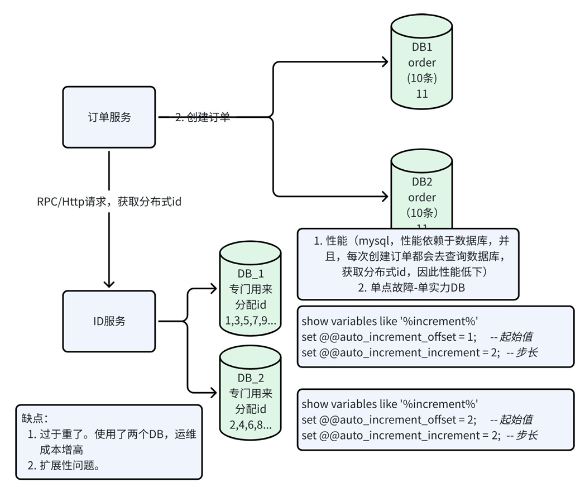

# 分布式ID

## 课程大纲



## 一、分布式id基础认知篇

### 1.UUID

UUID (Universally Unique Identifier),通用唯一识别码。UUID是基于当前时间、计数器(counter)和硬件标识(通常为无线网卡的MAC地址)等数据计算生成的。

UUID 是由一组32位数的16进制数字所构成,以连字号分隔的五组来显示,形式为8-4-4-4-12,总共有36个字符(即三十二个英数字母和四个连字号)。

例如:

```java
public static void main(String[]args){
System.out.println(UUID.randomUUID().toString()); //6cdcb280-e684-42d7-8284-7c682072574d
//获取32位的UUID
System.out.println(UUID.randomUUID().toString().replace("-","")); //d078be7d404e416e96af00571f4c7da3
}
```

aefbbd3a-9cc5-4655-8363-a2a43e6e6c80

xxxxxxxx-xxxx-Mxxx-Nxxx-xxxxxxxxxxxx

> M：版本(Version)。告诉你这个UUID是如何生成的。
> - 版本1(M =1)：基于时间和节点ID(通常是MAC地址)生成。保证了基于时间和空间的唯一性。
> - 版本2(M =2)：DCE安全版本,基于版本1，但将部分时间戳替换为本地域标识符(如用户ID或组ID)，较少使用。
> - 版本3(M =3)：基于名称和命名空间的MD5哈希生成。通过计算一个命名空间(本身是一个UUID)和一个名称(字符串)的哈希值来生成确定性UUID。
> - 版本4(M =4)：随机生成。这是最常见和最简单的版本。除了固定位置的版本号和变体号比特位,其他所有比特位都是随机或伪随机的。
> - 版本5(M =5)：基于名称和命名空间的SHA-1哈希生成。与版本3类似,但使用更安全的SHA-1算法,是版本3的首选替代方案。
> - 版本6-8(M =6,7,8)：新版基于时间戳的UUID,是版本1的改进和扩展,旨在解决版本1的一些已知问题(如时间戳排序)。
>
> N:变体(Variant)。定义如何解释UUID的比特位
> - 变体 1(N = 8,9,a,b)：这是当前最主流的变体。所有RFC 4122中定义的UUID版本(1-8)都使用此变体。在字符串中,这意味着第四组的第一个字符通常是8,9,a ,或b (二进制最高位为10xx )。
>

#### 优点

- 简单，代码方便
- 性能好，全球唯一

#### 缺点
- 无序，无法保证趋势递增
- 太长了，传输效率低
- 使用字符存储，查询效率低下

**UUID适不适合做我们的分布式ID?**

不适合！
1. 关系型数据库(mysql,oracle),要求主键长度越短越好，UUID过长了，并且还是字符存储,所以不是很推荐。
2. 主键、普通索引、底层使用的是 B+ 树，但是我们的 UUID 是无序的，意味着每次**插入**的时候，都需要对 B+ 树进行大幅度的调整，对插入的效率很大影响。

3. 信息安全，由于 UUID 基于 MAC 地址生成的，因此可能会造成 MAC 地址的泄漏。就像利用了这个漏洞去寻找梅丽莎病毒的制作者的位置。

**UUID适用场景:**
邀请码、令牌、认证 key……

### 2.自增id

针对表结构的主键,我们常规的操作是在创建表结构的时候给对应的ID设置auto_increment .也就是勾选自增选项。



只能满足单表下唯一，分库分表时，无法保证唯一。



**解决办法**

创建一个表结构

```sql
CREATE TABLE test_order_id (
id bigint NOT NULL AUTO_INCREMENT,
title char(1)NOT NULL,
PRIMARY KEY (id),
UNIQUE KEY title (title)
)ENGINE =InnoDB AUTO_INCREMENT=1DEFAULT CHARSET =utf8;
```

然后通过更新ID操作来获取ID信息

```sql
BEGIN;
REPLACE INTO test_order_id (title)values ('p');
SELECT LAST_INSERT_ID();//获取当前会话的最新id
COMMIT;
```

**缺点:**

1. 基于数据库实现的,每次都需要从数据库获取Id,因此性能堪忧
2. 单点故障问题。

### 3.数据库多主模式

单点数据库方式存在明显的性能问题,可以对数据库进行高可用优化,担心一个主节点挂掉没法使用,可以选择做双主模式集群,也就是两个MySQL实例都能单独生产自增的ID。

那这样还会有个问题,两个 MySQL 实例的自增ID都从1开始,会生成重复的ID怎么办?

**解决方案:** 设置起始值和自增步长

**MySQL_1配置:**
```sql
show variables like '%increment%'
set @@auto_increment_offset =1;--起始值
set @@auto_increment_increment =2;--步长
```

**MySQL_2配置:**
```sql
show variables like '%increment%'
set @@auto_increment_offset =2;--起始值
set @@auto_increment_increment =2;--步长
```

这样两个MySQL实例的自增ID分别就是:
- MySQL_1:1、3、5、7、9
- MySQL_2:2、4、6、8、10

**缺点:** 扩展性不足

### 4.号段模式

号段模式是当下分布式ID生成器的主流实现方式之一,号段模式可以理解为从数据库批量的获取自增ID,每次从数据库取出一个号段范围,例如(1,1000]代表1000个ID,具体的业务服务将本号段,生成1~1000的自增ID并加载到内存。表结构如下:

```sql
CREATE TABLE id_generator (
id int(10)NOT NULL,
max_id bigint(20)NOT NULL COMMENT '当前最大id',
step int(20)NOT NULL COMMENT '号段的布长',
biz_type int(20)NOT NULL COMMENT '业务类型',
PRIMARY KEY (id)
)
```

**字段说明:**
- biz_type :代表不同业务类型
- max_id :当前最大的可用id
- step :代表号段的长度

等这批号段ID用完,再次向数据库申请新号段,对max_id字段做一次update操作

```sql
begin transaction;
update id_generator set max_id =max_id+step where biz_type =XXX;
select *from id_generator where biz_type=XXX
commit
```

添加 version 字段实现乐观锁：

```sql
CREATE TABLE id_generator (
id int(10) NOT NULL,
max_id bigint(20) NOT NULL COMMENT '当前最大id',
step int(20) NOT NULL COMMENT '号段的布长',
biz_type int(20) NOT NULL COMMENT '业务类型',
version int(2) NOT NULL DEFAULT 1,
PRIMARY KEY (id)
)
```

**实现方案1**：控制事务，先锁行

```
begin transaction (开启事务)
update id_generator set max_id = max_id + step where biz_type ='pay_order_type';
select * from id_generator where biz_type ='pay_order_type';
commit;
```

**实现方案2**：先获取，再 update version 乐观锁

```sql
select * from id_generator where biz_type = 'pay_order_type'; // 获取到当前 max_id, step, version
update id_generator set max_id = #{max_id} + #{step}, version = #{version} + 1 
where biz_type = 'pay_order_type' and version = #{version};
```

**问题**：使用乐观锁，在高并发的情况下，会导致 update 频繁失败。

### 5.基于Redis实现

利用 redis 的 incr 命令实现ID的原子性自增

```
127.0.0.1:6379>set seq_id 1//初始化自增ID为1
OK
127.0.0.1:6379>incr seq_id //增加1,并返回递增后的数值
(integer)2
```

因为使用 Redis 作为分布式ID，因此分布式id会有多个组成部分。
- 有序的id 数据库存储的要求 趋势递增或单调递增

**代码示例**（64位长度）：
- 符号位（1位）
- 时间戳（31位）
- 自增序列（32位）

```java
@SpringBootTest 
public class RedisDistributedIdTest {
    @Autowired 
    private StringRedisTemplate stringRedisTemplate;
    private static final long BEGIN_TIMESTAMP =1672531200l;
    
    /**
    *获取分布式id 366229370248888322
    *组成部分:符号位(1位)-时间戳(秒)[31位]-自增序列[32位]
    *@param bizType 业务类型
    *@return
    */
    @Test 
    public void nextId(){
        String bizType ="orderType";
        //1.获取时间戳
        LocalDateTime now =LocalDateTime.now();
        //格林威治时间戳(1970-01-01到现在的秒数)
        long epochSecond =now.toEpochSecond(ZoneOffset.UTC);
        long timestamp =epochSecond -BEGIN_TIMESTAMP;
        String date =now.format(DateTimeFormatter.ofPattern("yyyy:MM:dd"));
        //2.获取自增序列incr
        String redisKey ="id:"+bizType+":"+date;
        Long increment =stringRedisTemplate.opsForValue().increment(redisKey);
        //组装组成部分
        long id =timestamp <<32|increment;
        System.out.println(id);
    }
}
```

**缺点:**
1. ID生成的持久化问题。Redis宕机了怎么恢复?
2. 单点故障问题

**解决方案:**
利用Redis集群。比如我们有3个Redis的Master节点,初始化每个节点的值(1,2,3),设置步长为集群节点数(3)。

每个节点每次获取到的id:
- 节点1:1,4,7...
- 节点2:2,5,8...
- 节点3:3,6,9....

### 6.雪花算法(Snowflake)

Snowflake,雪花算法是由Twitter开源的分布式ID生成算法,以划分命名空间的方式将64bit位分割成了多个部分,每个部分都有具体的不同含义,在Java中64Bit位的整数是Long类型,所以在Java中Snowflake算法生成的ID就是long来存储的。具体如下:


**组成部分：**
- 第一部分:占用1bit,第一位为符号位,不适用
- 第二部分:41位的时间戳,41bit位可以表示2^41个数,每个数代表的是毫秒,那么雪花算法的时间年限是(2^41)/(1000×60×60×24×365)=69年
- 第三部分:10bit表示是机器数,即2^10=1024台机器,通常不会部署这么多机器
- 第四部分:12bit位是自增序列,可以表示2^12=4096个数,一毫秒内可以生成4096个ID

**完整代码实现：**

```java
/**
*Twitter_Snowflake
*SnowFlake的结构如下(每部分用-分开):
*0-00000000000000000000000000000000000000000-00000-00000-000000000000
*1位标识,由于long基本类型在Java中是带符号的,最高位是符号位,正数是0,负数是1,所以id 一般是正数,最高位是0
*41位时间截(毫秒级),注意,41位时间截不是存储当前时间的时间截,而是存储时间截的差值(当前时间截-开始时间截
*得到的值),这里的的开始时间截,一般是我们的id生成器开始使用的时间,由我们程序来指定的(如下下面程序IdWorker类的startTime属性)。41位的时间截,可以使用69年,年T =(1L <<
41)/(1000L *60*60*24*365)=69
*10位的数据机器位,可以部署在1024个节点,包括5位datacenterId和5位workerId
*12位序列,毫秒内的计数,12位的计数顺序号支持每个节点每毫秒(同一机器,同一时间截)产生4096个ID序号
*加起来刚好64位,为一个Long型。
*SnowFlake的优点是,整体上按照时间自增排序,并且整个分布式系统内不会产生ID碰撞(由数据中心ID和机器ID作区分),并且效率较高,经测试,SnowFlake每秒能够产生26万ID左右。
*/
public class SnowflakeIdWorker {
    //==============================Fields===========================================
    /**
    *开始时间截(2020-11-03,一旦确定不可更改,否则时间被回调,或者改变,可能会造成id 重复或冲突)
    */
    private final long twepoch =1604374294980L;
    /**
    *机器id所占的位数
    */
    private final long workerIdBits =5L;
    /**
    *数据标识id所占的位数
    */
    private final long datacenterIdBits =5L;
    /**
    *支持的最大机器id,结果是31(这个移位算法可以很快的计算出几位二进制数所能表示的最大十进制数)
    */
    private final long maxWorkerId =-1L ^(-1L <<workerIdBits);
    /**
    *支持的最大数据标识id,结果是31
    */
    private final long maxDatacenterId =-1L ^(-1L <<datacenterIdBits);
    /**
    *序列在id中占的位数
    */
    private final long sequenceBits =12L;
    /**
    *机器ID向左移12位
    */
    private final long workerIdShift =sequenceBits;
    /**
    *数据标识id向左移17位(12+5)
    */
    private final long datacenterIdShift =sequenceBits +workerIdBits;
    /**
    *时间截向左移22位(5+5+12)
    */
    private final long timestampLeftShift =sequenceBits +workerIdBits +datacenterIdBits;
    /**
    *生成序列的掩码,这里为4095(0b111111111111=0xfff=4095)
    */
    private final long sequenceMask =-1L ^(-1L <<sequenceBits);
    /**
    *工作机器ID(0~31)
    */
    private long workerId;
    /**
    *数据中心ID(0~31)
    */
    private long datacenterId;
    /**
    *毫秒内序列(0~4095)
    */
    private long sequence =0L;
    /**
    *上次生成ID的时间截
    */
    private long lastTimestamp =-1L;
    
    //==============================Constructors=====================================
    /**
    *构造函数
    *
    */
    public SnowflakeIdWorker(){
        this.workerId =0L;
        this.datacenterId =0L;
    }
    
    /**
    *构造函数
    *
    *@param workerId 工作ID (0~31)
    *@param datacenterId 数据中心ID (0~31)
    */
    public SnowflakeIdWorker(long workerId,long datacenterId){
        if (workerId >maxWorkerId ||workerId <0){
            throw new IllegalArgumentException(String.format("worker Id can't be greater than %d or less than 0",maxWorkerId));
        }
        if (datacenterId >maxDatacenterId ||datacenterId <0){
            throw new IllegalArgumentException(String.format("datacenter Id can't be greater than %d or less than 0",maxDatacenterId));
        }
        this.workerId =workerId;
        this.datacenterId =datacenterId;
    }
    
    //==============================Methods==========================================
    /**
    *获得下一个ID (该方法是线程安全的)
    *
    *@return SnowflakeId
    */
    public synchronized long nextId(){
        long timestamp =timeGen();
        
        //如果当前时间小于上一次ID生成的时间戳,说明系统时钟回退过这个时候应当抛出异常
        if (timestamp <lastTimestamp){
            throw new RuntimeException(String.format("Clock moved backwards.Refusing to generate id for %d milliseconds",lastTimestamp -timestamp));
        }
        
        //如果是同一时间生成的,则进行毫秒内序列
        if (lastTimestamp ==timestamp){
            sequence =(sequence +1)&sequenceMask;
            //毫秒内序列溢出
            if (sequence ==0){
                //阻塞到下一个毫秒,获得新的时间戳
                timestamp =tilNextMillis(lastTimestamp);
            }
        }
        //时间戳改变,毫秒内序列重置
        else {
            sequence =0L;
        }
        
        //最新生成ID的时间截
        lastTimestamp =timestamp;
        
        //移位并通过或运算拼到一起组成64位的ID
        return ((timestamp -twepoch)<<timestampLeftShift) //时间戳
            |(datacenterId <<datacenterIdShift) //数据中心
            |(workerId <<workerIdShift) //机器id
            |sequence; //序列
    }
    
    /**
    *阻塞到下一个毫秒,直到获得新的时间戳
    *
    *@param lastTimestamp 上次生成ID的时间截
    *@return 当前时间戳
    */
    protected long tilNextMillis(long lastTimestamp){
        long timestamp =timeGen();
        while (timestamp <=lastTimestamp){
            timestamp =timeGen();
        }
        return timestamp;
    }
    
    /**
    *返回以毫秒为单位的当前时间
    *
    *@return 当前时间(毫秒)
    */
    protected long timeGen(){
        return System.currentTimeMillis();
    }
    
    /**
    *随机id生成,使用雪花算法
    *
    *@return
    */
    public static String getSnowId(){
        SnowflakeIdWorker sf =new SnowflakeIdWorker();
        String id =String.valueOf(sf.nextId());
        return id;
    }
    
    //=========================================Test=========================================
    /**
    *测试
    */
    public static void main(String[]args){
        SnowflakeIdWorker idWorker =new SnowflakeIdWorker(0,0);
        for (int i =0;i <1000;i++){
            long id =idWorker.nextId();
            System.out.println(id);
        }
    }
}
```

#### 时间回拨问题

**方案1:** 等待时钟同步
- 适用于回退时间较短（<100ms）

**方案2:** 下线切换战场
- 回退时间很长(>1s)时，利用服务注册中心下线异常服务，将流量切换到正常节点


**方案3:** 内存逻辑时钟
- 核心思想:不直接信任操作系统的时钟,而在内存中维护一个逻辑时间。这个逻辑时间只增不减。
  - a. 内存中保存一个时间(logicalTimestamp)
  - b. 每次生成id时,获取系统当前时间(sysTimestamp),比较sysTimestamp与logicalTimestamp取其中的最大值。
    - i. sysTimestamp > logicalTimestamp,说明时间正常,用sysTimestamp更新logicalTimestamp,并重置序列号。
    - ii. sysTimestamp < logicalTimestamp,说明发生了时钟回拨问题,直接让logicalTimestamp+1,更新logicalTimestamp=logicalTimestamp+1(逻辑时间前进1毫秒),需要重置序列号。
    - iii. sysTimestamp = logicalTimestamp,说明在同一个毫秒内,sequence +1

**方案4:** 抛出异常告警(兜底方案)
- 直接抛异常! 如果时钟回退时间非常长(超过了1天)

**时钟回拨问题解决方案对比：**

| 方案名称     | 核心原理                                                     | 优点                               | 缺点                               | 适用场景                               |
| :----------- | :----------------------------------------------------------- | :--------------------------------- | :--------------------------------- | :------------------------------------- |
| 等待时钟同步 | 线程睡眠等待                                                 | 简单有效                           | 造成短暂延迟                       | 适用于时间回退时长较短情况 (<100ms)    |
| 下线切换战场 | 利用服务注册中心，下线异常服务，将流量切换到正常的服务节点上去获取分布式id | 业务系统无感                       | 架构相对复杂，实现难度相对大       | 适用于微服务架构，对高可用要求较高系统 |
| 内存逻辑时钟 | 维护自增时间戳                                               | 彻底解决了回拨带来分布式id重复问题 | 内存时间戳与物理时间戳是完全脱节的 | 时间戳不参与业务                       |
| 抛异常告警   | 熔断止损                                                     | 实现超级简单，防止数据污染         | 服务不可用                         | 兜底方案                               |

**组合使用方案:**
```
if(回拨量<100ms)->方案1(等待)
Else if(回拨量>100ms && 回拨量<5s) --> 方案2或者方案3(需要根据系统架构来定到底是使用方案2还是方案3)
Else --> 抛出异常告警
```

## 二、分布式id开源项目篇

### 1.美团Leaf

由美团开发,开源项目链接:https://github.com/Meituan-Dianping/Leaf

Leaf同时支持号段模式(Leaf-Segment)和snowflake算法模式(Leaf-snowflake),可以切换使用。ID号码是趋势递增的8byte的64位数字,满足上述数据库存储的主键要求。

Leaf的snowflake模式依赖于ZooKeeper,不同于原始snowflake算法也主要是在workId的生成上,Leaf中workId是基于ZooKeeper的顺序Id来生成的,每个应用在使用Leaf-snowflake时,启动时都会都在Zookeeper中生成一个顺序Id,相当于一台机器对应一个顺序节点,也就是一个workId。

Leaf的号段模式是对直接用数据库自增ID充当分布式ID的一种优化,减少对数据库的频率操作。相当于从数据库批量的获取自增ID,每次从数据库取出一个号段范围,例如(1,1000]代表1000个ID。

**特性:**
1. 全局唯一,绝对不会出现重复的ID,且ID整体趋势递增。
2. 高可用,服务完全基于分布式架构,即使MySQL宕机,也能容忍一段时间的数据库不可用。
3. 高并发低延时,在CentOS 4C8G的虚拟机上,远程调用QPS可达5W+,TP99在1ms内。
4. 接入简单,直接通过公司RPC服务或者HTTP调用即可接入。

Leaf采用双buffer的方式,它的服务内部有两个号段缓存区segment。当前号段已消耗10%时,还没能拿到下一个号段,则会另启一个更新线程去更新下一个号段。

简而言之就是Leaf保证了总是会多缓存两个号段,即便哪一时刻数据库挂了,也会保证发号服务可以正常工作一段时间。

### 2.Mybatis-plus Idworker

MyBatis-Plus IdWorker 雪花算法实现深度分析

### 3.百度Uidgenerator

UidGenerator核心设计与原理深度解析

## 三、分布式Id实战篇

基于Redis+雪花实现分布式id组件

小绿书分布式id方案设计

- 提供springboot-start
- 通过缩短时间戳位数，来增大workerId和sequence的位数
  - 时间戳(29位)，支持使用时间大约为17年
  - workerId(16位)，0-65536 —— 基于redis incr来实现，由于位数足够多，因此在实现上会变得简单很多，直接使用 redis incr的方式分配workerId即可，达到限制后再重新从0开始计算
  - 数据中心(2位)，0-3，支持4个机房部署
  - sequence(16位)，0-65536 —— 支持一秒内产生65536个id
- 可观测性 —— 支持多项指标监控
- 代码的可扩展性和可维护性
  - workerId的分配逻辑抽象 —— 支持自定义分配逻辑
  - 监控逻辑的抽象 —— 支持自定义监控逻辑
- 高性能 —— 压测结果：6w+ qps
